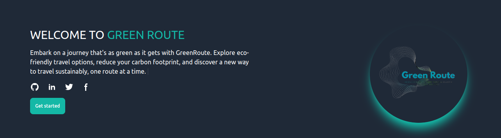
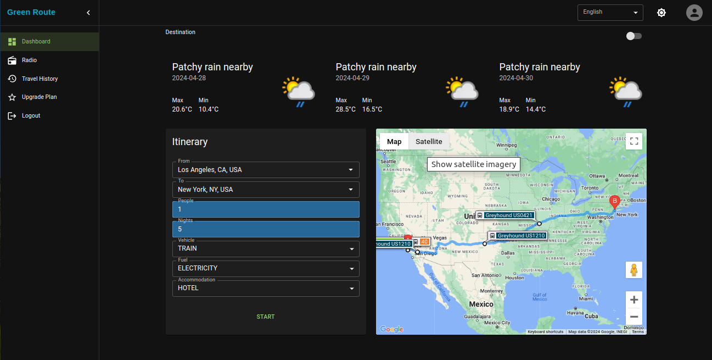
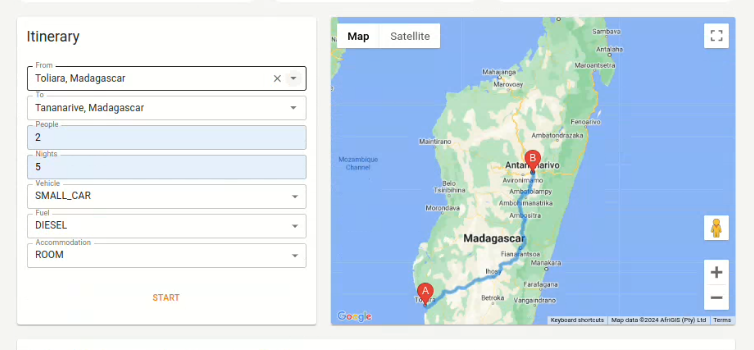
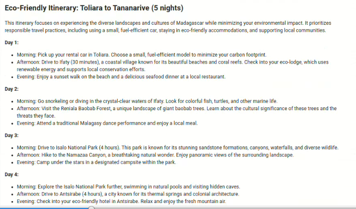
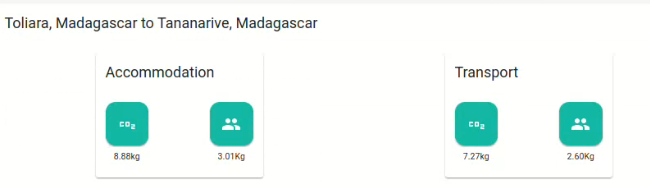
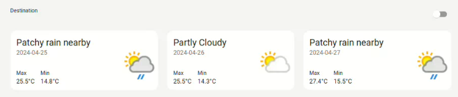
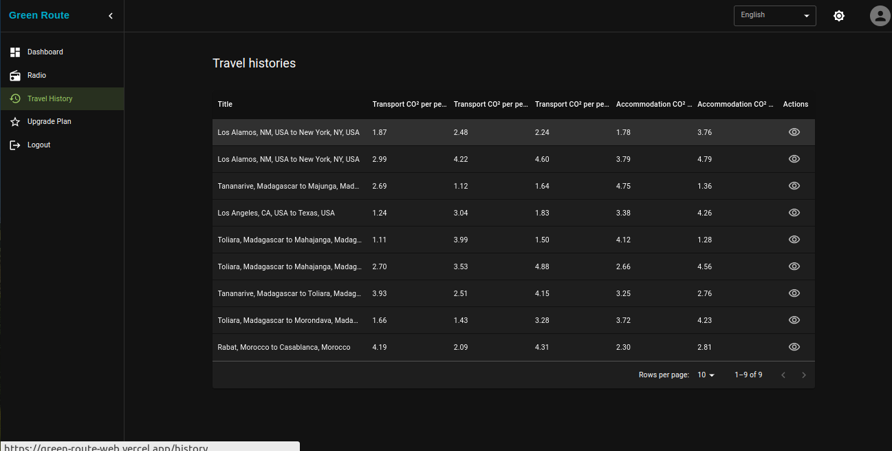
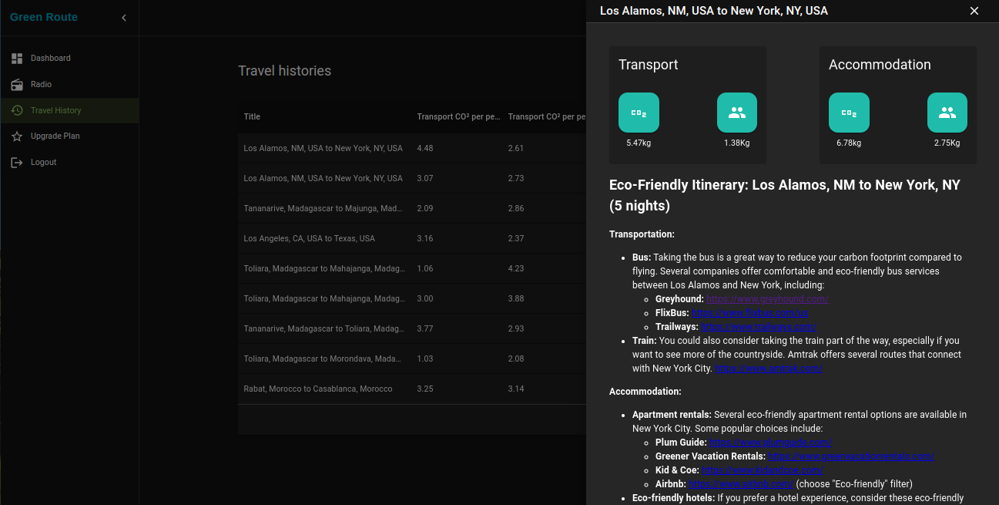
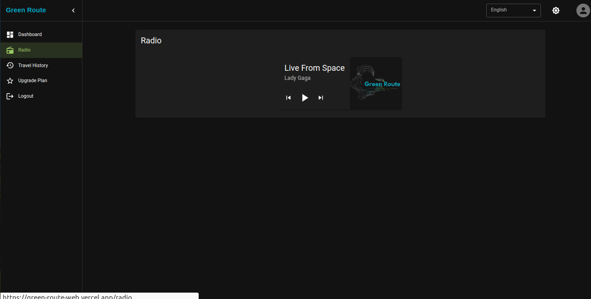
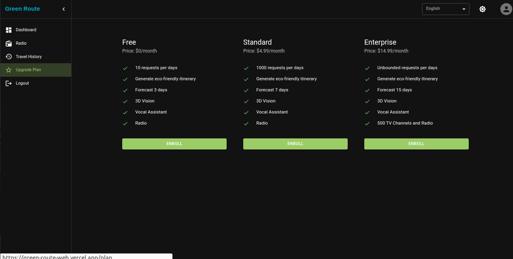

# Green Route

`GreenRoute` is a revolutionary application that leverages `Google's Generative AI` to provide eco-conscious travelers with sustainable and environmentally friendly travel options. By analyzing transportation and accommodation choices, GreenRoute aims to minimize carbon footprints while offering enriching travel experiences.

## Features
**Eco-friendly Route Planning**: Users can input their starting point, destination, and sustainability preferences. GreenRoute then generates eco-friendly routes and provides insightful descriptions on how to enjoy the journey sustainably.

**Environmental Impact Tracking**: Users can monitor their overall carbon footprint and visualize how their travel choices contribute to emissions, empowering them to make informed decisions.

**Weather Forecast**: GreenRoute offers weather forecast for both the origin and destination, ensuring travelers are prepared for their journey.

**History**: Users can view their past travel prompts, helping them track their sustainability progress and revisit memorable trips.

# Upcoming Features

**Virtual Assistant**: Introducing a virtual guide feature to assist travelers during their journeys, providing information and recommendations.

**Radio Stations Integration**: Users can enjoy music and stay informed while traveling by accessing integrated radio stations.

**Business Plan**: A new business plan option will be available for users looking to upgrade their services at an affordable price.

# Installation of this API
To run the Green Route API locally as a Spring Boot application, follow these steps:

- ***Prerequisites***:
    - Java 17 or higher installed.
    - Database credentials (DB_URL, DB_USER, DB_PASSWORD) for PostgreSQL.
- ***Environment Setup***:
    - Configure your $JAVA_HOME environment variable.
    - Set up the following environment variables in your application.properties or application.yml file:
    <pre>
        spring.application.name=route
        spring.flyway.locations=classpath:/db/migration
        spring.jpa.hibernate.ddl-auto=none
        spring.jpa.show-sql=false
        spring.jpa.open-in-view=true
        spring.datasource.url=${DB_URL}
        spring.datasource.username=${DB_USER}
        spring.datasource.password=${DB_PASSWORD}
        gemini.project.id=${GEMINI_PROJECT_ID}
        gemini.location=${GEMINI_LOCATION}
        gemini.type=gemini-pro
        gemini.api.key=${GEMINI_API_KEY}
        travel.api.key=${TRAVEL_API_KEY}
        travel.api.url=https://travelco2.com
        sentry.dsn=${SENTRY_DSN}
        sentry.environment=${SENTRY_ENV}
        firebase.private.key=${FIREBASE_API_KEY}
        weather.api.key=${WEATHER_API_KEY}
        weather.api.url=https://api.weatherapi.com
        bucket.name=greenroute
    </pre>
- ***Run the Application***:
Use your IDE or the command line to build and run the Spring Boot application.